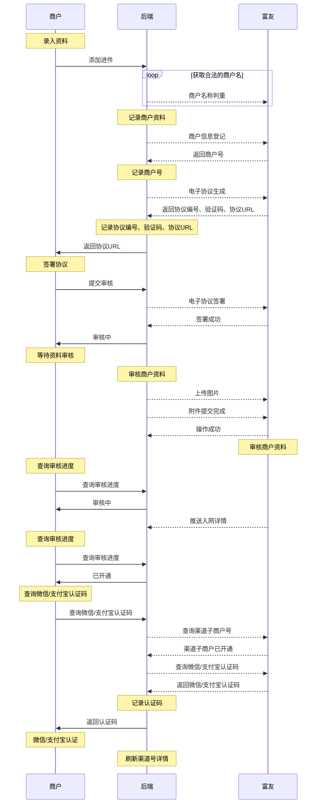

```mermaid
sequenceDiagram
note over 商户: 录入资料
商户->>后端: 添加进件
loop 获取合法的商户名
	后端-->>富友: 商户名称判重
end
note over 后端: 记录商户资料
后端-->>富友: 商户信息登记
富友-->>后端: 返回商户号
Note over 后端: 记录商户号
后端-->>富友: 电子协议生成
富友-->>后端: 返回协议编号、验证码、协议URL
Note over 后端: 记录协议编号、验证码、协议URL
后端->>商户: 返回协议URL
Note over 商户: 签署协议
商户->>后端: 提交审核
后端-->>富友: 电子协议签署
富友-->>后端: 签署成功
后端->>商户: 审核中
note over 商户: 等待资料审核
note over 后端: 审核商户资料
后端-->>富友: 上传图片
后端-->>富友: 附件提交完成
富友-->>后端: 操作成功
note over 富友: 审核商户资料
note over 商户: 查询审核进度
商户->>后端: 查询审核进度
后端->>商户: 审核中
富友-->>后端: 推送入网详情
note over 商户: 查询审核进度
商户->>后端: 查询审核进度
后端->>商户: 已开通
note over 商户: 查询微信/支付宝认证码
商户->>后端: 查询微信/支付宝认证码
后端-->>富友: 查询渠道子商户号
富友-->>后端: 渠道子商户已开通
后端-->>富友: 查询微信/支付宝认证码
富友-->>后端: 返回微信/支付宝认证码
note over 后端: 记录认证码
后端->>商户: 返回认证码
note over 商户: 微信/支付宝认证
note over 后端: 刷新渠道号详情
```